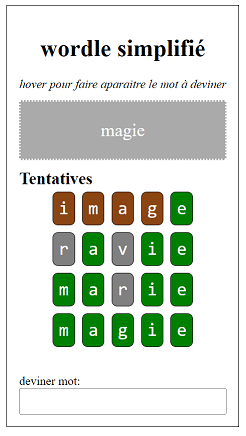

# Test technique wordle dans angular

Ce test technique a pour but de valider les capacités techniques du candidat à réfléchir à un problème et proposer des solutions tout en partageant en live sa réflexion.

# Ce que nous voulons réaliser

Le but de l'exercice est de réaliser une version simplifiée du jeu "Wordle". Le jeu se déroule comme suit:

- Un mot à 5 lettres est choisi au hasard
- L'utilisateur tente de deviner le mot en entrant des tentatives de 5 lettres
- Pour chaque tentative, on montre à l'utilisateur sa tentative. Pour chaque lettre, si la lettre est présente dans le mot au bon endroit, elle est affichée en vert, si présente dans le mot mais placée au mauvais endroit elle est affichée en marron, et si non présente dans le mot elle est affichée en gris.

Voici une copie d'écran donnée en exemple:

# Réalisation

1. cloner le repository git, installer via `npm i`, démarrer le serveur via `ng serve`, ouvrir son navigateur à l'adresse http://localhost:4200/
2. Ouvrir en édition le composant affiché dans `src/app`
3. Lier l'input à un FormControl, souscrire à ses changements et s'assurer que le champ texte lié n'ait jamais plus de 5 caractères
4. écouter l'event `<Enter>` sur le champ texte et ajouter la tentative à une liste de tentatives effectuées pour le jeu
5. Pour chaque tentative, afficher les lettres du mot dans le template html sous `#board`, dans un div de class `guess`, chaque lettre dans un span avec classe `bonendroit`, `mauvaisendroit` ou `nonpresent`, en la comparant à la variable `word`.

Réfléchissez à voix haute, le but n'est pas seulement d'arriver au bout de l'exercice mais aussi de partager son approche et sa réflexion.